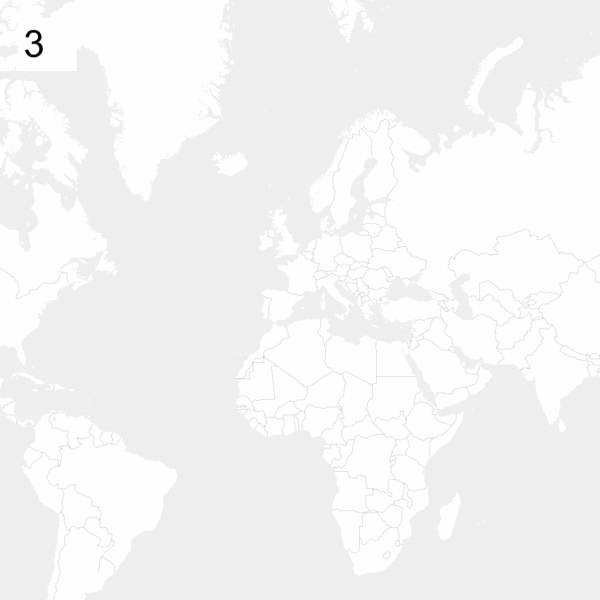

# tilewarm

A command-line tool to warm up your tile server cache. Give it a URL template, coordinates, and list of zoom levels and it will systematically request all tile images in the given area.

```bash
npm install -g @alvarcarto/tilewarm
```

Docker example:
```bash
docker build -t tilewarm .
docker run tilewarm http://yourtileserver.com/{z}/{x}/{y}.png --input geojson/world.geojson --zoom 1-5
```

## Examples

**1-5 levels, 20km radius from the center of Barcelona**

```bash
tilewarm http://yourtileserver.com/{z}/{x}/{y}.png --point 41.38,2.16 --buffer 20km --zoom 1-5
```

**1-5 levels of the world (~1.3k requests)**

```bash
tilewarm http://yourtileserver.com/{z}/{x}/{y}.png --input geojson/world.geojson --zoom 1-5
```

**1,3,5 levels of the world (~1k requests)**

```bash
tilewarm http://yourtileserver.com/{z}/{x}/{y}.png --input geojson/world.geojson --zoom 1,3,5
```

**6-8 levels for all cities in the world (~4k requests)**

```bash
tilewarm http://yourtileserver.com/{z}/{x}/{y}.png --input geojson/all-cities.geojson --zoom 6-8
```

**6-14 levels for all cities in the world (~1.2M requests)**

```bash
tilewarm http://yourtileserver.com/{z}/{x}/{y}.png --input geojson/all-cities.geojson --zoom 6-14
```

**15 level for all cities in the world (~3M requests)**

```bash
tilewarm http://yourtileserver.com/{z}/{x}/{y}.png --input geojson/all-cities.geojson --zoom 15
```


## Usage

```
Usage:  <url> [options]

<url>   Tile URL template


Options:
  --verbose          Increase logging                 [boolean] [default: false]
  -h, --help         Show help                                         [boolean]
  -p, --point        Center of region (use with -b)                     [string]
  -b, --buffer       Buffer point/geometry by an amount. Affix units at end:
                     mi,km                             [string] [default: "0km"]
  -z, --zoom         Zoom levels (comma separated or range)
                                                       [string] [default: "3-9"]
  -l, --list         Don't perform any requests, just list all tile URLs
                                                      [boolean] [default: false]
  -i, --input        GeoJSON input file                 [string] [default: null]
  -c, --concurrency  How  many concurrent requests to execute       [default: 5]
  -m, --method       Which HTTP method to use in requests
                                                       [string] [default: "GET"]
  -v, --version      Show version number                               [boolean]

Examples:
  tilewarm http://tileserver.com/{z}/{x}/{y}.png --point 62.31,23.12 --buffer 10km
```

### Warming cache for all cities in the world

Form a geojson for all cities in the world.

```bash
node tools/cities-to-geojson.js tools/cities.csv > cities.geojson

# Put geojson to clipboard, works on Mac
cat cities.geojson | pbcopy
```

You can debug the geojson by pasting it into http://geojson.io/. The file can
be compressed even more with https://www.npmjs.com/package/geojson-precision.


Then run:

```
tilewarm http://yourtileserver.com/{z}/{x}/{y}.png --input cities.geojson
```


## Zoom levels visually

Each zoom level 3-19.




# Contributors


## Release

* Commit all changes.
* Use [np](https://github.com/sindresorhus/npm) to automate the release:

    `np`

* Edit GitHub release notes.


## Attribution

This tool is almost a rewrite of [tilemantle](https://github.com/naturalatlas/tilemantle), which hadn't been updated for a while and had a crash bug for our
use case.


# License

MIT
